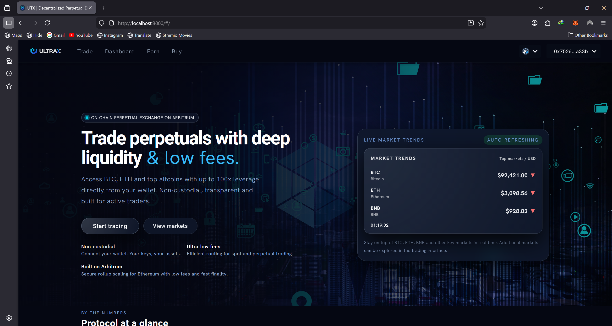
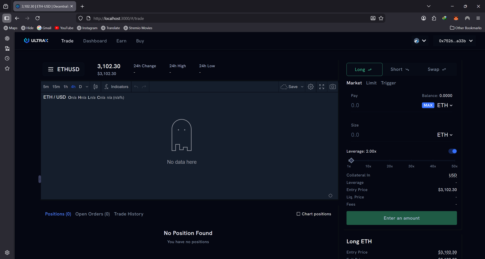
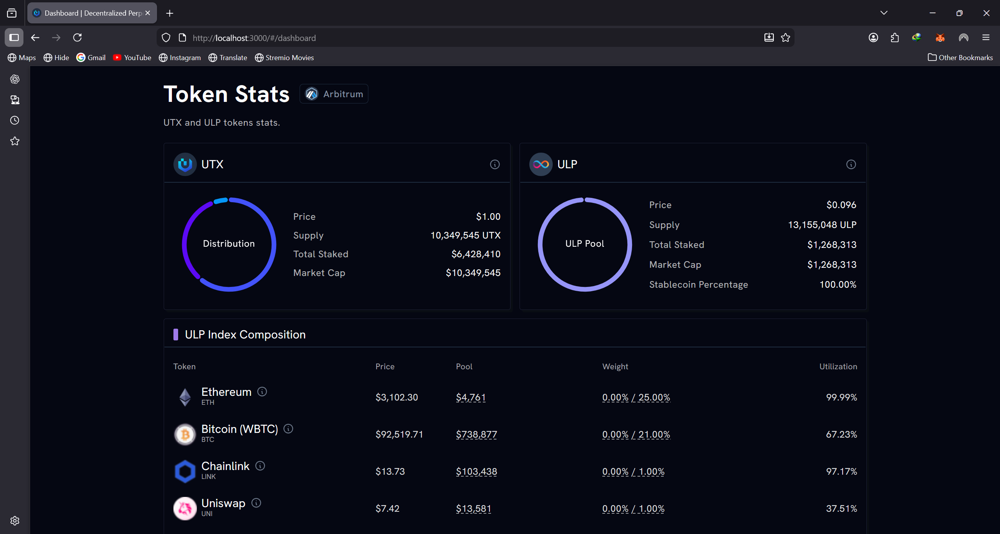
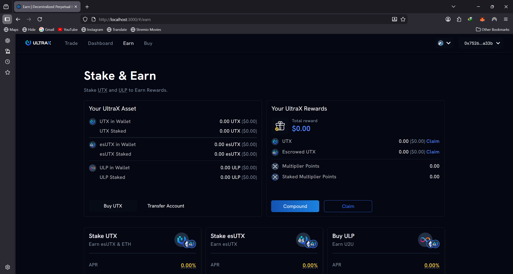
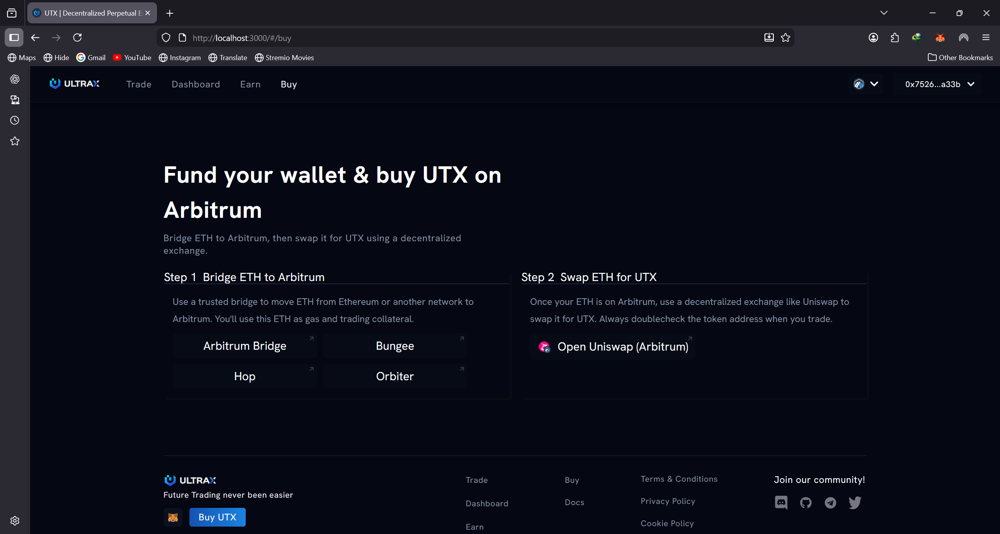

## How to run our project?

### Install dependencies

```bash
  npm install
```
Use node version **18 or 20** to avoid dependency issues.

### Start the server

```bash
  npm start
```

### BNB Price Tracker (new)
- Backend endpoint: `GET /api/bnb-price` returns `{ price, lastUpdated, up }`
- 6s cache, ±0–2% simulated drift, 10 req/min/IP limit, CORS restricted to `FRONTEND_ORIGIN`
- Homepage “Market Trends” card polls every 10s with dynamic background
- See full docs: `docs/BNB_PRICE_TRACKER.md`

## Introduction

**Website:**

#### UI Screenshots

The following screenshots show key sections of the ULTRAX dApp (served from `public/images`):

- Homepage

  

- Trade

  

- Earn

  

- Buy

  

- Dashboard

  

#### Overview of the Website

The website offers a comprehensive platform for trading and managing cryptocurrency assets, featuring four main modules: **Trade**, **Dashboard**, **Earn**, and **Buy**. Each module is designed to provide users with essential tools and information for effective trading and investment.

#### 1. Trade

In the **Trade** section, users can access a detailed trading view graph for selected tokens. Key features include:

- **Current Token Price**, **Token Volume**, and **High/Low Price** over the last 24 hours.
- A comprehensive **Trading History** and an overview of the user's **Wallet Position**, including both **Sell** and **Buy Token Orders**.

The **Exchange** section allows users to select tokens, specify amounts, set leverage, and choose the type of exchange action. The wallet's token amounts are automatically populated in the interface for convenience.

#### 2. Dashboard

The **Dashboard** provides a snapshot of the exchange's current status, displaying vital statistics such as:

- **24h Volume**
- **Open Interest**
- **Long and Short Positions**
- An overview of the **Liquidity Pool**
- Total statistics for the exchange
- Insights into governance tokens, specifically **UTX** and **ULP**
- **ULP/UTX Index Composition**, which details the pairings within the liquidity pool.

#### 3. Earn

The **Earn** module focuses on staking UTX and ULP tokens to earn rewards (esUTX). Key features include:

- An overview of the connected wallet, showing owned tokens (UTX, esUTX, ULP) and claimable rewards.
- Options to buy tokens for staking, unstake tokens from pools, and claim rewards from each pool.
- Detailed information on **Staking Pools**, including total staked tokens, reward token prices, total supply, and APR/multiplier points.
- A **Vault Vesting** feature that allows users to convert rewards to UTX, deposit or withdraw rewards, and claim UTX.

#### 4. Buy

In the **Buy** section, users can easily purchase UTX or ULP using their preferred payment methods. 

- **UTX** serves as the utility and governance token, accruing **30%** of the platform's generated fees.
- **ULP** is the liquidity provider token, accruing **70%** of the platform's generated fees.

Users can buy UTX from decentralized exchanges or centralized services, with links provided for easy access. Additionally, users can buy or sell ULP directly from the exchange, including transactions involving listed tokens like ETH, USDT, BTC, and BNB.

This platform is designed to empower users with the tools and information necessary for successful trading and investment in the cryptocurrency market.